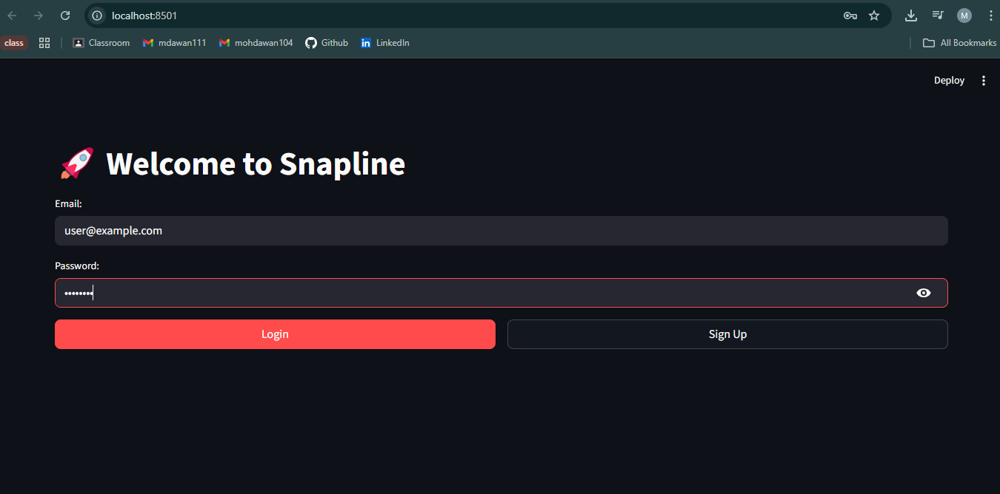
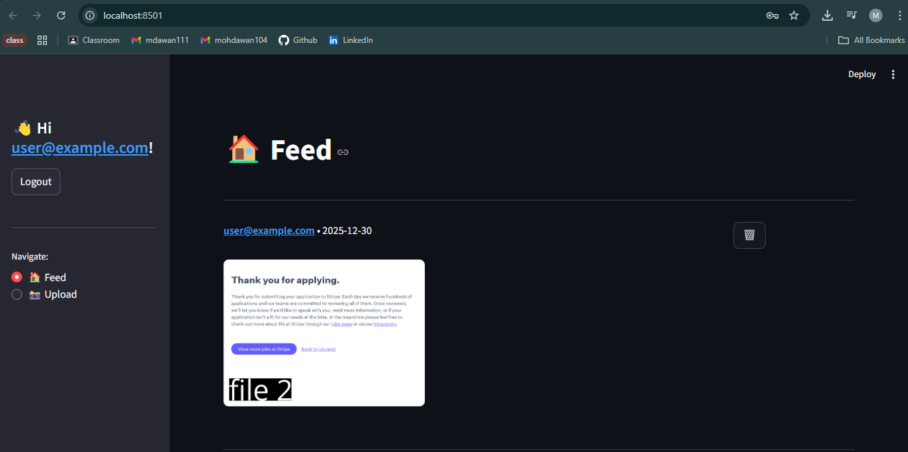
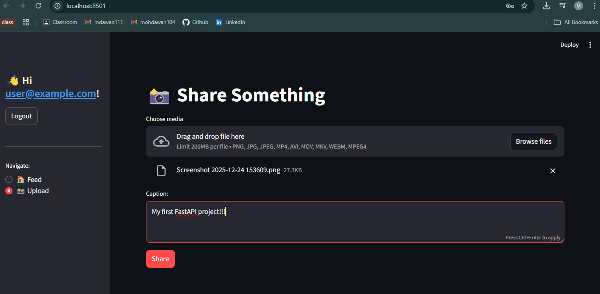
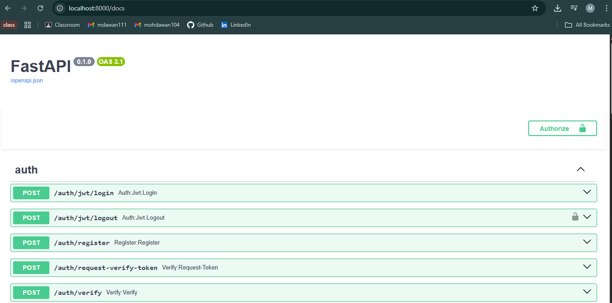
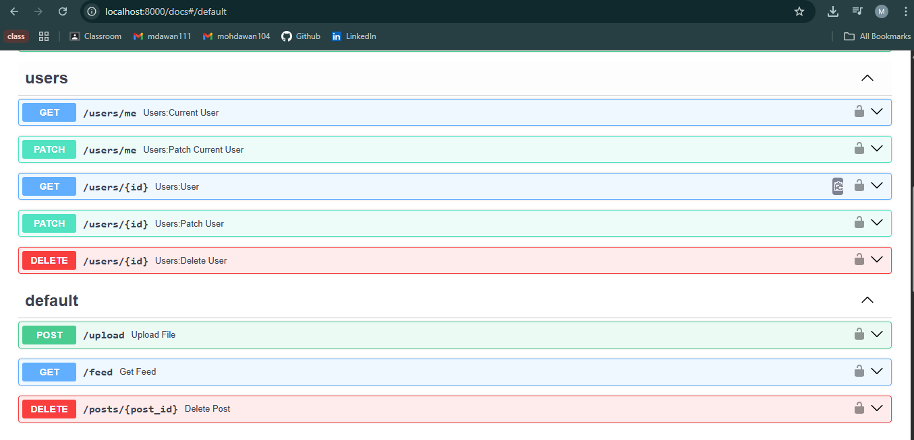

# Snapline

### A Scalable Social Media Backend using FastAPI

Snapline is a backend-only social media application built with **FastAPI**, designed to handle user authentication, photo and video uploads, and a performant media feed. The project focuses on clean API design, async performance, and production-ready backend architecture.

---

## 🚀 Features

* User authentication and authorization (JWT-based)
* Photo and video upload APIs
* Chronological media feed
* Async database operations using SQLAlchemy
* Scalable and extensible backend design

---

## 🛠️ Tech Stack

* **FastAPI** – High-performance backend framework
* **SQLAlchemy (Async)** – ORM for database interactions
* **SQLite** – Database
* **FastAPI Users** – Authentication and user management
* **Pydantic** – Data validation and serialization
* **Streamlit** – Simple frontend for interacting with the backend
* **Uvicorn** – ASGI server
* **uv** – Dependency and environment management

---

## ⚙️ Setup & Installation

### 1️⃣ Clone the repository

```bash
git clone https://github.com/mohammedawan/snapline.git
cd snapline
```

### 2️⃣ Install dependencies using uv

```bash
uv venv
uv pip install -r requirements.txt
```

### 3️⃣ Run the FastAPI backend

```bash
uvicorn main.py --reload
```

### 4️⃣ Run the Streamlit frontend

```bash
streamlit run /app/frontend.py
```

Backend will be available at:

```
http://127.0.0.1:8000
```

Frontend will be available at:

```
http://localhost:8501
```

---

## 📘 API Documentation

FastAPI provides interactive API documentation out of the box:

* **Swagger UI** → `http://127.0.0.1:8000/docs`
* **ReDoc** → `http://127.0.0.1:8000/redoc`

---

## 📸 Screenshots

### 🔐 Login Page


Simple authentication interface for user login.

### 📰 Feed Page


Displays a chronological feed of photo and video posts.

### ⬆️ Upload Page


Allows users to upload photos or videos with captions.

### 📑 FastAPI Docs – Swagger UI



Interactive API documentation generated by FastAPI.

---

## 🔗 API Endpoint Examples

| Endpoint  | Method | Description                      |
| --------- | ------ | -------------------------------- |
| `/login`  | POST   | Authenticate user and return JWT |
| `/feed`   | GET    | Fetch media feed                 |
| `/upload` | POST   | Upload photo or video            |

---

## 🧠 Design Highlights

* Fully **async backend** for improved concurrency and lower latency
* Clear modular structure for maintainability
* ORM-based relational data modeling for users and posts
* Authentication-first approach for secure access

---

## 🔮 Future Enhancements

* Background tasks for media processing
* Rate limiting and request throttling
* Role-based access control
* Caching frequently accessed feeds

---

## 📌 Project Goal

Snapline was built as a **resume-oriented backend project** to demonstrate real-world backend engineering skills, including API design, authentication, async programming, and database modeling.

---

## 👤 Author

**Mohammed Awan Hashir Ali**

Computer Science Engineering (AIML)
